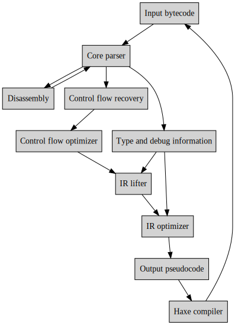

# crashlink


Pure Python HashLink bytecode parser/disassembler/decompiler/modding tool

> [!WARNING]
> This project is under active development. Breaking changes may be made to APIs with zero notice.

## Features

- Pure Python with zero dependencies, integrates nicely in a lot of places (IDAPython compatible!)
- Allows values to be externally modified and reserialised through a scriptable interface
- A very nice little CLI with [hlbc](https://github.com/Gui-Yom/hlbc)-compatible mode.

## Installation

```bash
pip install crashlink
```

Optionally, install `tqdm` for progress bars when parsing large files:

```bash
pip install crashlink[tqdm]
```

You also need to have Graphviz installed to generate control flow graphs. On most *nix systems, on Windows (with Chocolatey or Scoop), and on MacOS (with Homebrew), you can install it with your package manager under `graphviz`.

- Windows: `choco install graphviz`
- MacOS: `brew install graphviz`
- Debian: `sudo apt install graphviz`
- Arch: `sudo pacman -S graphviz`
- Fedora: `sudo dnf install graphviz`

## Usage

Either:

```py
from crashlink import *
code = Bytecode.from_path("path/to/file.hl")
if code.fn(22): # 22 and 240 are typical entry points for the compiler to generate
  print(disasm.func(code.fn(22)))
elif code.fn(240):
  print(disasm.func(code.fn(240)))
# > f@22 static $Clazz.main () -> Void (from Clazz.hx)
# > Reg types:
# >   0. Void
# >
# > Ops:
# >   0. Ret             {'ret': 0}                                       return
```

Or:

```txt
$ crashlink path/to/file.hl # or python -m crashlink
crashlink> funcs
f@22 static Clazz.main () -> Void (from Clazz.hx)
f@23 Clazz.method (Clazz) -> I32 (from Clazz.hx)
crashlink> fn 22
f@22 static Clazz.main () -> Void (from Clazz.hx)
Reg types:
  0. Void

Ops:
  0. Ret             {'ret': 0}                                       return
```

## Development

> [!NOTE]
> This project is configured for the [just](https://just.systems/) command runner. If you don't have it installed, you can still run the commands in the `justfile` manually, but I don't recommend it.

For development purposes, you can clone the repo, install development dependencies, and run the tests:

```bash
git clone https://github.com/N3rdL0rd/crashlink
cd crashlink
# optionally, create and activate a venv here.
just install # or pip install -e .[dev]
just test # or pytest
```

Before committing, please run `just dev` to format the code, run tests, and generate documentation in `docs/`. If you're adding new features to the core serialisation/deserialisation code (`core.py`), please also add a test case in `tests/haxe/` for the new language feature you're adding. If you're adding a feature to the decompiler or disassembler, please add a normal test case (in Python) in `tests/` that tests the new feature.

Pull requests are always welcome! For major changes, please open an issue first to discuss what you would like to change.

You can use the following pre-defined commands with `just`:

- `just dev`: Run tests, format code, and generate documentation.
- `just build`: Build the package.
- `just install`: Install development dependencies and the package in editable mode.
- `just build-tests`: Build test samples.
- `just test`: Run tests.
- `just format`: Format code.
- `just docs`: Generate documentation.
- `just check`: Run static analysis/typechecking.
- `just clean`: Clean up build artifacts.
- `just profile`: Run the test suite with cProfile and then open the results in a browser.
- `just serve-docs`: Serve the documentation locally.

## Architecture



> [!NOTE]
> IR and the IR optimization layers have not yet been fully implemented.

## Roadmap

- [ ] IR lifter (layer 0)
  - [x] If statements
  - [ ] Loops
  - [ ] Switch opcode statements
  - [ ] Function calls
    - [ ] CallClosure
  - [ ] Closures
- [ ] IR optimization layers
  - [ ] SSA locals
  - [ ] Trace optimization
  - [ ] Nested if/else/if/else -> switch
- [ ] IR -> Haxe
- [ ] Partial recompilation (against stubs of other functions)
- [ ] GUI? (customtkinter or dearpygui)
  - [ ] Graphical disassembler
  - [ ] Embedded CFG viewer through some Graphviz bindings
  - [ ] Decompiler and patching interface
  - [ ] IR layer viewer

## Credits

- Thank you to [Gui-Yom](https://github.com/Gui-Yom) for writing hlbc and for maintaining documentation on the HashLink bytecode format, as well as for providing tests and helping me during development.
- Thank you to [Haxe Foundation](https://haxe.org/) for creating the HashLink VM and the Haxe programming language.
- And a big thank you to you, dear user, for being at least partially interested in this project.

❤ N3rdL0rd
